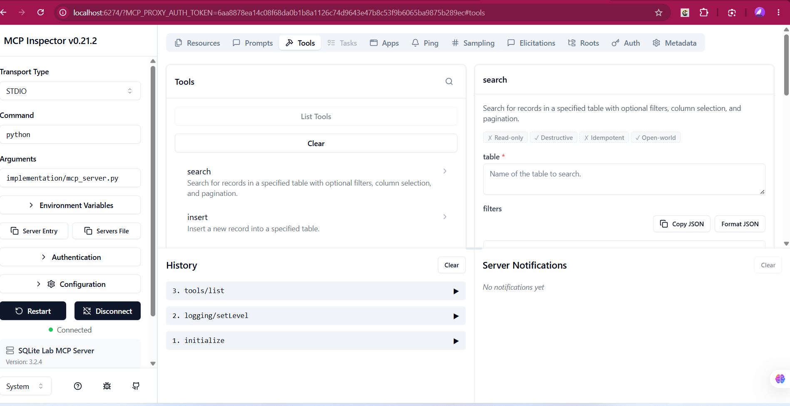
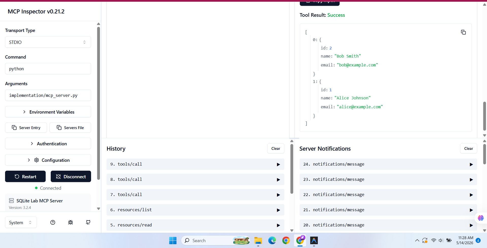
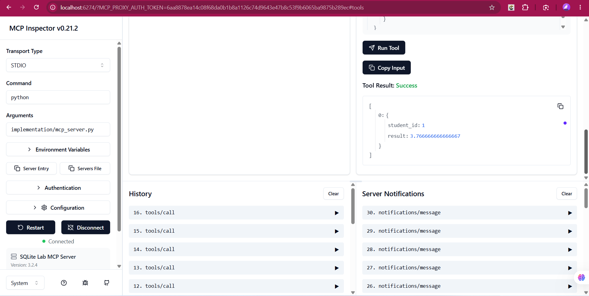
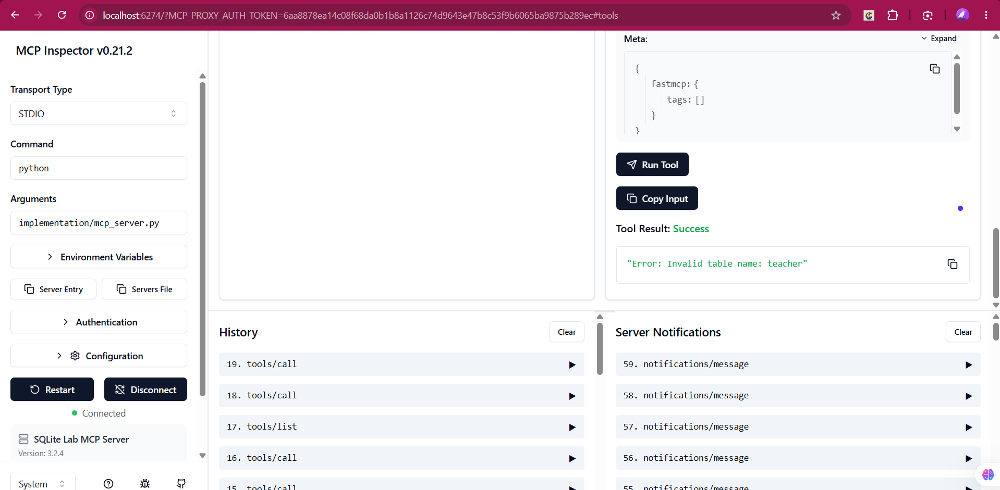
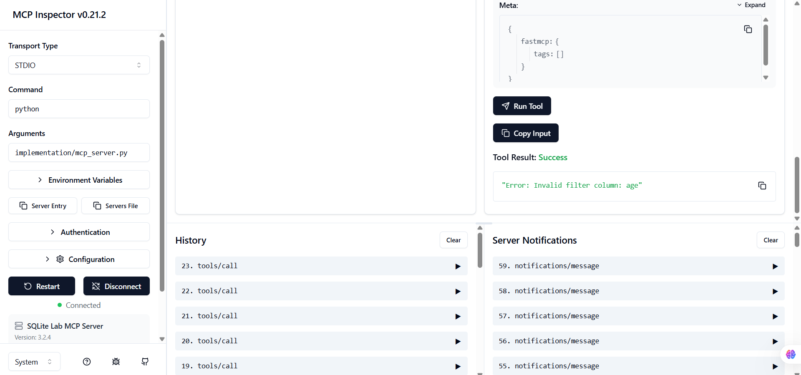

# Kịch bản Test MCP Server (Demo Script)

Tài liệu này hướng dẫn các bước test và các điểm cần chụp ảnh để hoàn thiện bài nộp Lab 26.

## 1. Chuẩn bị (Setup)
- Đảm bảo đã chạy `python init_db.py`.
- Chạy lệnh: `npx @modelcontextprotocol/inspector python implementation/mcp_server.py`.
- Truy cập `localhost:3000` và nhấn nút **Connect**.

---

## 2. Các bước Test & Ảnh cần chụp

### 📸 Ảnh 1: Giao diện Kết nối thành công
- **Thao tác:** Sau khi nhấn Connect, dấu chấm chuyển sang màu xanh lá.
- **Yêu cầu:** Chụp toàn màn hình thấy rõ các tab `List Tools` và `List Resources`.

### 📸 Ảnh 2: Khám phá Tài nguyên (Schema Resource)
- **Thao tác:** 
  - Chọn tab **Resources**.
  - Tìm `schema://database`, nhấn **Read Resource**.
- **Yêu cầu:** Chụp màn hình khung kết quả hiện ra cấu hình JSON của toàn bộ Database.

### 📸 Ảnh 3: Truy vấn dữ liệu (Search Tool)
- **Thao tác:**
  - Chọn tab **Tools**, chọn tool `search`.
  - Nhập Arguments:
    - `table`: `"students"`
    - `filters`: `{"cohort": "A1"}`
  - Nhấn **Run Tool**.
- **Yêu cầu:** Chụp kết quả trả về danh sách sinh viên Alice và Bob.

### 📸 Ảnh 4: Tính toán dữ liệu (Aggregate Tool)
- **Thao tác:**
  - Chọn tool `aggregate`.
  - Nhập Arguments:
    - `table`: `"enrollments"`
    - `metric`: `"AVG"`
    - `column`: `"grade"`
  - Nhấn **Run Tool**.
- **Yêu cầu:** Chụp kết quả hiện ra điểm trung bình (xấp xỉ 3.65).

### 📸 Ảnh 5: Xử lý lỗi (Validation - Unknown Table)
- **Thao tác:**
  - Chọn tool `search`.
  - Nhập `table`: `"id_teacher"`.
  - Nhấn **Run Tool**.
- **Yêu cầu:** Chụp thông báo lỗi màu đỏ hiện ra: `"Error: Table 'id_teacher' does not exist."`

### 📸 Ảnh 6: Xử lý lỗi (Validation - Unknown Column)
- **Thao tác:**
  - Chọn tool `search`.
  - Nhập `table`: `"students"`.
  - Nhập `filters`: `{"age": 20}`.
  - Nhấn **Run Tool**.
- **Yêu cầu:** Chụp thông báo lỗi: `"Error: Invalid filter column: age"`

---
